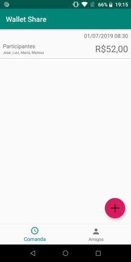
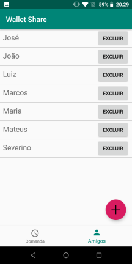
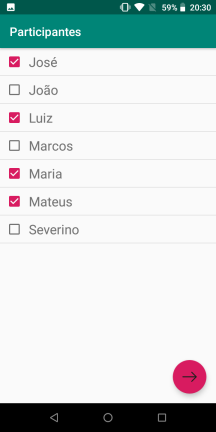
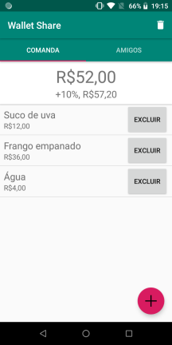
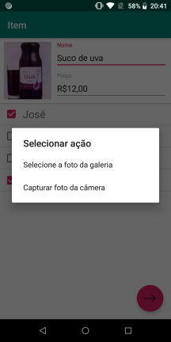
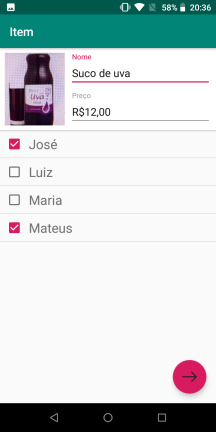
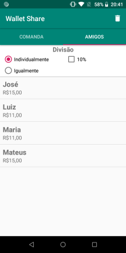

# Wallet Share

## Idealização
---
A ideia do aplicativo veio quando fui almoçar com o pessoal do trabalho e lá tivemos algumas dificuldades para dividir a conta, então tive a ideia de fazer um app para facilitar esse trabalho, então nasceu o Wallet Share.

## Desenvolvimento
---
O aplicativo foi feito em Android usando kotlin como linguagem, a persistência dos dados foi feita usando Room a seguir as classes persistidas.

```
@Dao
interface FriendDao {

    @Query("SELECT * FROM friend ORDER by name")
    fun all(): List<Friend>

    @Insert
    fun insert(friend: Friend): Long

    @Delete
    fun remove(vararg friend: Friend)
}
```
```
@Dao
interface OrderSheetDao {

    @Query("SELECT * FROM orderSheet ORDER BY date DESC")
    fun all(): List<OrderSheet>

    @Insert(onConflict = OnConflictStrategy.REPLACE)
    fun insert(orderSheet: OrderSheet): Long

    @Delete
    fun remove(vararg orderSheet: OrderSheet)
}
```

Outro recurso bastente usado foi o conceito de linguagem funcional para o código ficar mais limpo.
```
fun total(): Double {
    return items.map { it.price }.sum()
}

fun valueFor(friend: Friend): Double {
    val items = itemFor(friend)
    return items.map { it.dividedPrice() ?: 0.0 }.sum()
}

fun itemFor(friend: Friend): List<Item> {
    return items.filter { !it.people.map { f -> f.name.equals(friend.name) }.filter { it }.isEmpty() }
}
```

## Principais classes
---
As classes Item e OrderSheet, foram responsáveis pela logica de divisão de conta.
```
class OrderSheet: Serializable {
    
    @PrimaryKey(autoGenerate = true)
    var id: Long = 0L
    var name: String = ""
    var date: Date = Date()
    var people: MutableList<Friend> = mutableListOf()
    var items: MutableList<Item> = mutableListOf()

    fun total(): Double {
        return items.map { it.price }.sum()
    }

    fun split(): Double {
        return total() / people.count()
    }

    fun valueFor(friend: Friend): Double {
        val items = itemFor(friend)
        return items.map { it.dividedPrice() ?: 0.0 }.sum()
    }

    fun itemFor(friend: Friend): List<Item> {
        return items.filter { !it.people.map { f -> f.name.equals(friend.name) }.filter { it }.isEmpty() }
    }

    fun remove(friend: Friend) {
        people.remove(friend)
        items.forEach {
            it.remove(friend)
        }
    }

    fun remove(item: Item) {
        items.remove(item)
    }
}
```

```
class Item: Serializable {

    @PrimaryKey(autoGenerate = true)
    var id: Long = 0L
    var name: String = ""
    var price: Double = 0.0
    var people: MutableList<Friend> = mutableListOf()

    @ColumnInfo(typeAffinity = ColumnInfo.BLOB)
    var image: ByteArray? = null

    fun dividedPrice(): Double? {
        if (people.isEmpty()) {
            return null
        }else{
            return price / people.count()
        }
    }

    fun remove(friend: Friend) {
        people.remove(friend)
    }
}
```

As extensões a seguir foram bastantes importantes para o aplicativo no geral, ajustando dados para ser exibidos.
```
fun Double.percent(value: Double): Double {
    val percent = this * value
    return this + percent
}

fun Double.currencyFormatting(): String {
    val numberFormat = NumberFormat.getCurrencyInstance()
    return numberFormat.format(this)
}

fun Date.toSimpleString(): String {
    val format = SimpleDateFormat("dd/MM/yyy hh:mm")
    return format.format(this)
}

fun String.currencyInputFormatting(): String {
    return this.currencyFormattingToDouble().currencyFormatting()
}

fun String.currencyFormattingToDouble(): Double {
    val regex = Regex("[^0-9]")
    val numbers =  regex.replace(this, "")
    return if (numbers.isEmpty()) 0.0 else (numbers.toDouble() / 100)
}
```

Outra classe importante foi a Data que ficou responsável por intermediar as chamadas do banco
```
class Data {
    private val nameDatabase: String = "wallet-database"
    var friendDao: FriendDao
    var orderSheetDao: OrderSheetDao

    constructor(context: Context) {
        val database = Room.databaseBuilder(context, AppDatabase::class.java, nameDatabase)
            .allowMainThreadQueries()
            .build()
        friendDao = database.friendDao()
        orderSheetDao = database.commandDao()
    }

    companion object Factory {
        private var instance: Data? = null
        fun getInstance(context: Context): Data {
            if (instance == null) {
                instance = Data(context)
            }
            return instance!!
        }
    }
}
```

## Arquivos
---
[Video de uso do aplicativo](https://drive.google.com/file/d/13wEF11TCaLK0OHy_zEyeBEswrJwazysg/view?usp=sharing)

[APK](https://drive.google.com/file/d/1j0qPst8396fR7FSyeCNpyQT9kdLz3u89/view?usp=sharing)

## Screeshots do App
---
Principais telas do aplicativo, mostrando um pouco suas funcionalidades.

||
||
||

